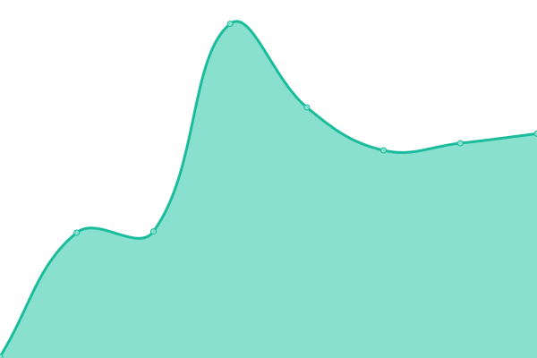
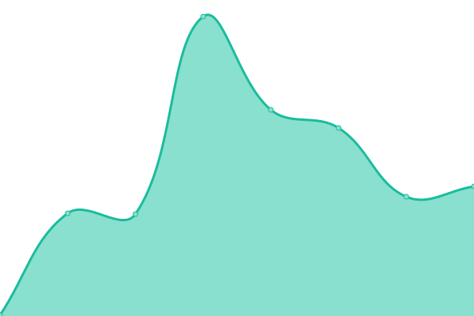

# [📈 Live Status](https://status.ktrain5369.me): <!--live status--> **🟩 All systems operational**

Upptime-powered site for all KTrain5169/KTools2202 websites.

<!--start: status pages-->
<!-- This summary is generated by Upptime (https://github.com/upptime/upptime) -->
<!-- Do not edit this manually, your changes will be overwritten -->
<!-- prettier-ignore -->
| URL | Status | History | Response Time | Uptime |
| --- | ------ | ------- | ------------- | ------ |
|  [Root website (ktrain5369.me)](https://ktrain5369.me/) | 🟩 Up | [root-website-ktrain5369-me.yml](https://github.com/KTrain5169/uptime-status/commits/HEAD/history/root-website-ktrain5369-me.yml) | 

 213ms
     
 | 

<a href="https://status.ktrain5369.me/history/root-website-ktrain5369-me">99.82%</a>
    

|  [NoSocialMediaBans](https://socialmediabans.ktrain5369.me/) | 🟩 Up | [no-social-media-bans.yml](https://github.com/KTrain5169/uptime-status/commits/HEAD/history/no-social-media-bans.yml) | 

 222ms
     
 | 

<a href="https://status.ktrain5369.me/history/no-social-media-bans">99.82%</a>
    

|  [NoSocialMediaBans Lite](https://socialmediabans-lite.ktrain5369.me/) | 🟩 Up | [no-social-media-bans-lite.yml](https://github.com/KTrain5169/uptime-status/commits/HEAD/history/no-social-media-bans-lite.yml) | 

 208ms
     
 | 

<a href="https://status.ktrain5369.me/history/no-social-media-bans-lite">99.82%</a>
    

|  [CatPack Crafter docs](https://catpacks.ktrain5369.me/) | 🟩 Up | [cat-pack-crafter-docs.yml](https://github.com/KTrain5169/uptime-status/commits/HEAD/history/cat-pack-crafter-docs.yml) | 

 190ms
     
 | 

<a href="https://status.ktrain5369.me/history/cat-pack-crafter-docs">99.82%</a>
    

|  [Stardust info website](https://stardust.ktrain5369.me/) | 🟩 Up | [stardust-info-website.yml](https://github.com/KTrain5169/uptime-status/commits/HEAD/history/stardust-info-website.yml) | 

 193ms
     
 | 

<a href="https://status.ktrain5369.me/history/stardust-info-website">99.82%</a>
    

|  [Git redirects](https://git.ktrain5369.me/) | 🟩 Up | [git-redirects.yml](https://github.com/KTrain5169/uptime-status/commits/HEAD/history/git-redirects.yml) | 

 237ms
     
 | 

<a href="https://status.ktrain5369.me/history/git-redirects">99.82%</a>
    

<!--end: status pages-->

## 📄 License

- Code: [MIT](./LICENSE) © [Anand Chowdhary](https://anandchowdhary.com), supported by [Pabio](https://pabio.com)
- Data in the `./history` directory: [Open Database License](https://opendatacommons.org/licenses/odbl/1-0/)
